<div align="center">

# KalmanLab CARLA Localization Benchmark

**A CARLA-based research framework for GNSS/IMU localization, Kalman-family filtering, offline replay, closed-loop autonomous evaluation, and filter auto-tuning.**


<br />


</div>

---

## What This Project Is

KalmanLab is an autonomous-driving localization benchmark built on top of the
[CARLA simulator](https://carla.org/). It simulates noisy GNSS and IMU streams,
projects geodetic GNSS data into a local map frame, runs pluggable localization
filters, and evaluates estimator behavior both offline and inside a closed-loop
vehicle-control task.

The project is designed for experiments where the same route, noise profile,
controller behavior, and filter parameters must be compared reproducibly.

**Core idea:** separate localization quality from driving performance, then
bring them back together in closed-loop trials.

| Mode | Purpose | What It Measures |
| --- | --- | --- |
| **Live dashboard** | Run CARLA, visualize sensors, route tracking, and active filter state | Real-time pose, GNSS trail, route progress, control state |
| **Offline localization replay** | Replay identical recorded GNSS/IMU logs through multiple filters | Filter-only RMSE, yaw/speed error, NIS/NEES consistency |
| **Closed-loop benchmark** | Drive saved routes using filtered localization | Completion, cross-track behavior, localization error during control |
| **Auto-tuning** | Search filter parameters against recorded logs or closed-loop route trials | Lower objective score with verification against baseline |

---

## Research Motivation

Localization filters often look strong in isolation but fail once their
estimates are consumed by a controller. This repository studies that gap by
combining:

- **sensor-realistic localization inputs** from CARLA GNSS and IMU sensors,
- **Kalman-family motion models** with explicit filter covariance diagnostics,
- **offline replay** for identical-input filter comparisons,
- **closed-loop route following** for controller-facing estimator evaluation,
- **auto-tuning** to search process, measurement, and active-control parameters.

The result is a compact experimental framework for comparing estimator
accuracy, consistency, robustness, and usefulness for autonomous driving.

---

## System Overview

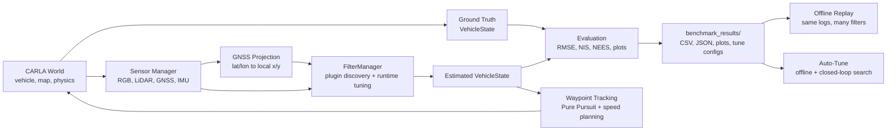

### Runtime Pipeline

1. CARLA is launched or reused on `localhost:2000`.
2. A startup screen lists available maps and benchmark modes.
3. The dashboard spawns an ego vehicle and attaches camera, GNSS, IMU, and LiDAR sensors.
4. GNSS latitude/longitude is projected into CARLA-local coordinates.
5. The active filter consumes GNSS/IMU frames and publishes an estimated `VehicleState`.
6. Route tracking, visualization, benchmarking, logging, and plot generation run from the same state abstraction.

---

## Highlights

| Area | Capabilities |
| --- | --- |
| 🛰️ **Sensor simulation** | CARLA GNSS and IMU noise/bias configuration, sensor tick control, GNSS local projection diagnostics |
| 🧭 **Localization filters** | Plugin-discovered KF, EKF, UKF, and raw GNSS baseline filters |
| 🚗 **Closed-loop driving** | Saved A/B routes, Pure Pursuit route tracking, curvature-aware speed planning, actuator realism |
| 📊 **Evaluation** | Per-route CSV/JSON summaries, trajectory plots, raw-vs-filtered errors, NIS, NEES, ±2σ bounds |
| 🔁 **Offline replay** | Replays identical recorded sensor logs through selected filters for fair filter-only comparison |
| 🧪 **Auto-tuning** | Offline tune search, closed-loop tune validation, saved tune config indexes |
| 🖥️ **Dashboard UI** | Multi-panel pygame dashboard with Route, Filters, Benchmark, Sensors, and Debug tabs |
| 🧩 **Extensibility** | Filter plugin template and metadata-based filter discovery |

---

## Visual Demo

The live dashboard combines CARLA camera output, route visualization, top-down
map state, filter diagnostics, benchmark controls, sensor controls, and driving
behavior panels.

<p align="center">
  
</p>

---

## Filters

Filters are discovered from
`carla_waypoint_project/src/KalmanLab/filters/`. Each plugin exposes
`FILTER_INFO`, `TUNE`, optional `TUNE_SPECS`, optional `AUTO_TUNE_PROFILE`, and
a `Filter` class consumed by `FilterManager`.

| Filter ID | Display Name | Family | State Vector | Measurements | Notes |
| --- | --- | --- | --- | --- | --- |
| `raw_gnss` | Raw GNSS | Baseline | `[px, py, speed, yaw]^T` | Projected GNSS latitude/longitude | Baseline only; not benchmark-selectable for autonomous control |
| `cv_kf` | CV-KF | Linear KF | `[px, py, vx, vy]^T` | GNSS x/y | Constant velocity model with optional IMU/control-assisted prediction |
| `ca_kf` | CA-KF | Linear KF | `[px, py, vx, vy, ax, ay]^T` | GNSS x/y + IMU acceleration x/y | Default active filter in `FilterManager` |
| `ego_kinematic_ekf` | Ego Kinematic EKF | EKF | `[px, py, yaw, speed]^T` | GNSS x/y + IMU compass yaw | Kinematic nonlinear propagation |
| `ctrv_ekf` | CTRV EKF | EKF | `[px, py, yaw, speed, yaw_rate]^T` | GNSS x/y + IMU yaw + IMU yaw-rate | Constant turn rate and velocity |
| `ctra_ekf` | CTRA EKF | EKF | `[px, py, yaw, speed, acceleration, yaw_rate]^T` | GNSS x/y + IMU yaw/yaw-rate/longitudinal acceleration | Experimental CTRA model with RK4 integration |
| `ctra_ukf` | CTRA UKF | UKF | `[px, py, yaw, speed, acceleration, yaw_rate]^T` | GNSS x/y + optional IMU yaw + IMU yaw-rate + acceleration | Experimental sigma-point CTRA model |

<details>
<summary><strong>Filter Plugin Contract</strong></summary>

New filters should follow `src/KalmanLab/filters/filter_template.py`.
The registry requires:

- `FILTER_INFO["id"]`
- `FILTER_INFO["name"]`
- `FILTER_INFO["type"]`
- `FILTER_INFO["state_vector"]`
- `FILTER_INFO["process_model"]`
- `FILTER_INFO["measurement_model"]`
- `FILTER_INFO["description"]`
- `TUNE`
- `class Filter`

Optional metadata controls dashboard behavior, benchmark eligibility,
autonomous-control safety, active tracking support, and auto-tune search space.

</details>

---

## Benchmark & Evaluation

KalmanLab records route-level samples and generates reproducible artifacts under
`carla_waypoint_project/benchmark_results/` by default. Runtime logs are ignored
by git.

### Metrics

| Metric Family | Examples |
| --- | --- |
| Position accuracy | RMSE, MAE, max error, final error, median, p95, p99 |
| Motion accuracy | yaw RMSE, speed RMSE, velocity RMSE |
| Consistency | NIS by measurement type, position NEES, covariance coverage |
| Robustness | divergence event count and divergence duration |
| Closed-loop behavior | route completion, cross-track error, timeout/abort reason |

### Example Evaluation Plots

<table>
  <tr>
    <td width="50%">
      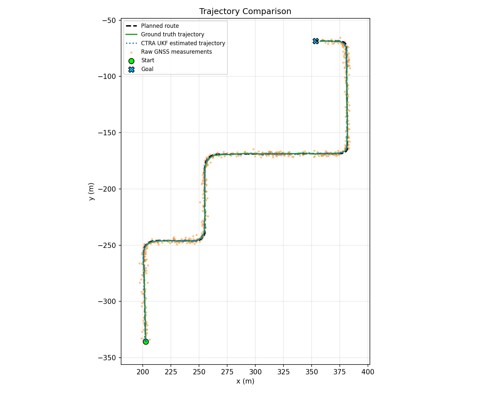
    </td>
    <td width="50%">
      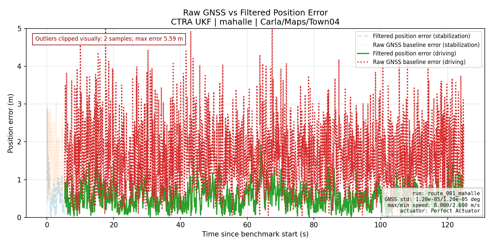
    </td>
  </tr>
  <tr>
    <td align="center"><strong>Trajectory comparison</strong></td>
    <td align="center"><strong>Raw GNSS vs filtered position error</strong></td>
  </tr>
  <tr>
    <td width="50%">
      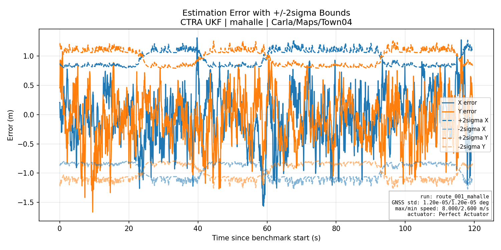
    </td>
    <td width="50%">
      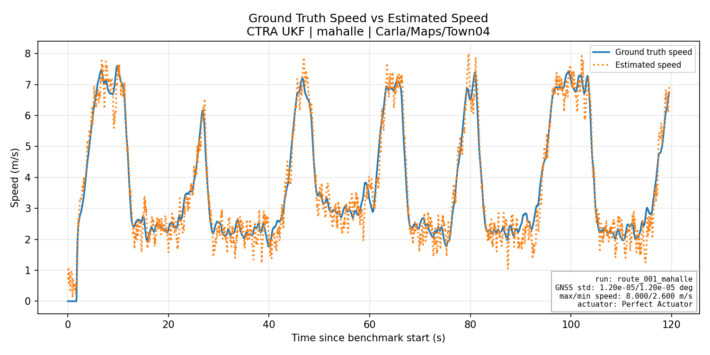
    </td>
  </tr>
  <tr>
    <td align="center"><strong>Estimation error with ±2σ bounds</strong></td>
    <td align="center"><strong>Ground-truth vs estimated speed</strong></td>
  </tr>
  <tr>
    <td width="50%">
      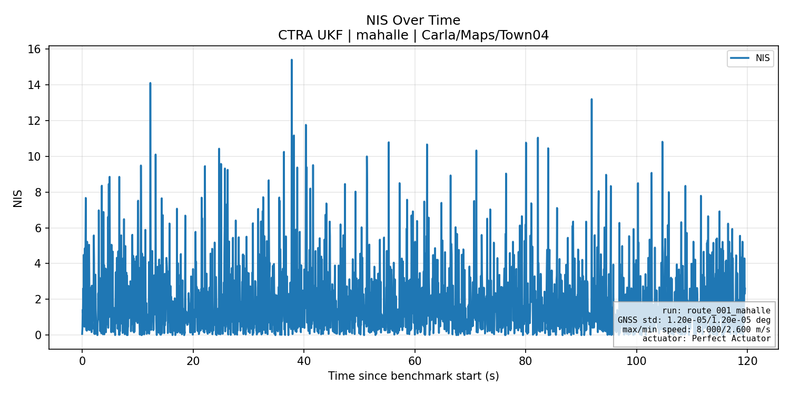
    </td>
    <td width="50%">
      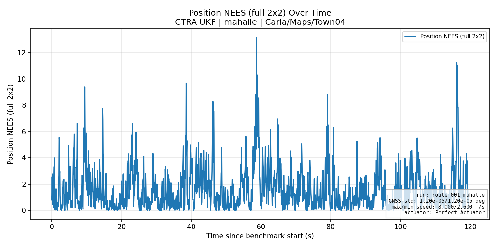
    </td>
  </tr>
  <tr>
    <td align="center"><strong>NIS over time</strong></td>
    <td align="center"><strong>NEES over time</strong></td>
  </tr>
</table>

<details>
<summary><strong>Generated Artifact Layout</strong></summary>

Typical generated files include:

```text
carla_waypoint_project/benchmark_results/
├── offline_localization/
│   ├── recordings/
│   │   └── <recording_id>/<route>/sensor_log.csv
│   └── evaluations/
│       └── <run_id>/
│           ├── aggregate_summary.csv
│           ├── aggregate_summary.json
│           └── route_*/replay_results/
├── closed_loop/
│   └── auto_tune/
└── _at/
    ├── cl/      # compact closed-loop auto-tune physical outputs
    └── ...
```

Closed-loop route runs also export route-level `timeseries.csv`,
`samples.csv`, `route_summary.json`, `summary.json`, and plot folders.

</details>

---

## Auto-Tuning

The repository includes two related tuning workflows:

| Workflow | Backend | Input | Output |
| --- | --- | --- | --- |
| **Offline auto-tune** | `FilterAutoTuner` | Recorded GNSS/IMU logs | Candidate leaderboard, verification results, saved tune config |
| **Closed-loop auto-tune** | `ClosedLoopBenchmarkAutoTuner` | Offline logs + validation route | Closed-loop route trial scores and validated tune config |

The offline tuner can use Optuna TPE when `optuna` is installed. If Optuna is
not available, the code falls back to a random/coordinate-refinement strategy.

<table>
  <tr>
    <td width="50%">
      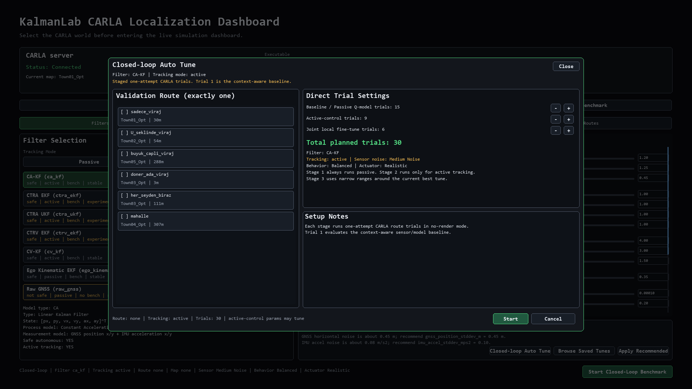
    </td>
    <td width="50%">
      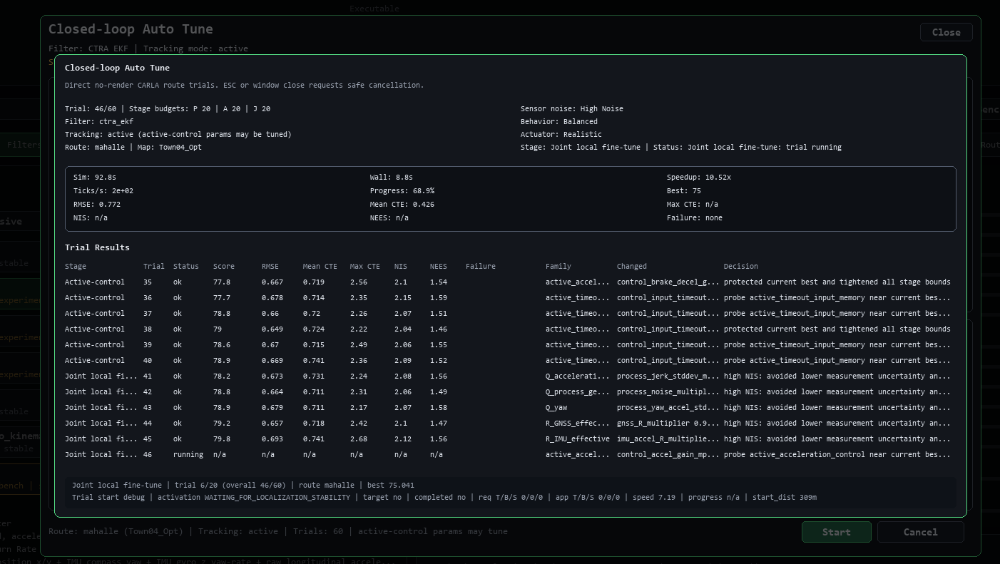
    </td>
  </tr>
  <tr>
    <td align="center"><strong>Auto-tune setup window</strong></td>
    <td align="center"><strong>Auto-tune process view</strong></td>
  </tr>
</table>

Auto-tuning uses filter-defined `AUTO_TUNE_PROFILE` metadata, locks physical
sensor-noise values from selected log profiles where appropriate, and writes
versioned tune configurations with compatibility metadata.

---

## Closed-Loop & Behavior Configuration

Closed-loop evaluation tests the complete estimator-controller-vehicle system.
The benchmark UI can select filters, routes, sensor noise presets, vehicle
behavior presets, actuator realism, tracking mode, and filter tune values.

<table>
  <tr>
    <td width="50%">
      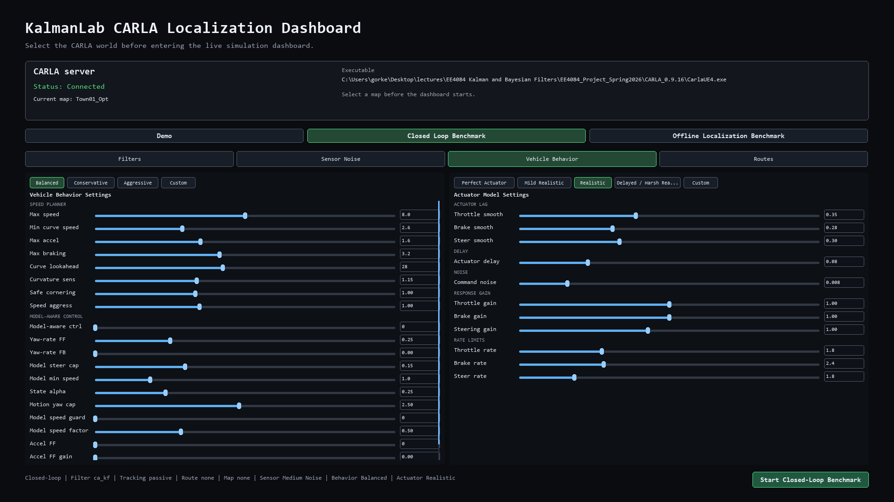
    </td>
    <td width="50%">
      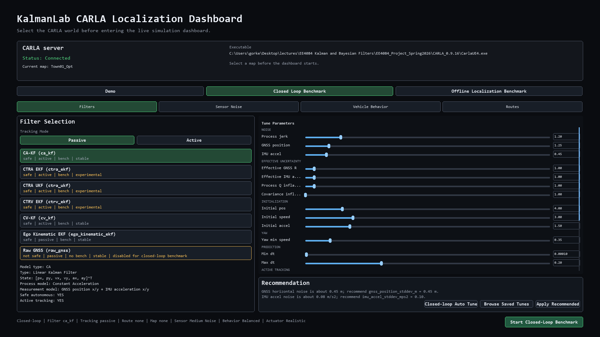
    </td>
  </tr>
  <tr>
    <td align="center"><strong>Driving behavior and actuator realism</strong></td>
    <td align="center"><strong>Closed-loop filter selection</strong></td>
  </tr>
</table>

Closed-loop trials include route initialization, localization stabilization,
autonomous route following, failure monitoring, and plot/report generation.

---

## Installation

### Prerequisites

| Requirement | Notes |
| --- | --- |
| CARLA | Project code is configured around `CARLA_0.9.16` |
| Python | Use a Python environment compatible with your CARLA Python API package. **TODO:** document the exact tested Python version. |
| OS | The launcher looks for `CarlaUE4.exe`, so the current setup is Windows-oriented. |

### Setup

From the repository root:

```powershell
cd carla_waypoint_project
python -m venv .venv
.\.venv\Scripts\Activate.ps1
python -m pip install --upgrade pip
pip install -r requirements.txt
```

Optional for Optuna-backed tuning:

```powershell
pip install optuna
```

### CARLA Discovery

`main.py` will reuse an already-running CARLA server on `localhost:2000`.
If no server is responding and `CARLA.auto_launch` is enabled, it searches for:

```text
./CARLA_0.9.16/CarlaUE4.exe
../CARLA_0.9.16/CarlaUE4.exe
./CARLA_0.9.16/WindowsNoEditor/CarlaUE4.exe
../CARLA_0.9.16/WindowsNoEditor/CarlaUE4.exe
```

You can also set `CARLA.executable_path` in
`carla_waypoint_project/config/settings.py`.

---

## Usage

Run the dashboard from the project package directory:

```powershell
cd carla_waypoint_project
python main.py
```

### Startup Screen

The startup UI appears before vehicles, sensors, filters, and benchmark tools
are initialized.

| Control | Action |
| --- | --- |
| `Up` / `Down` | Select map |
| Mouse wheel | Scroll map list |
| `Enter` / double click | Start selected map |
| `U` | Use current CARLA map |
| `R` | Refresh available maps |
| `Esc` | Quit safely |

The startup screen includes top-level modes for:

- **Demo**
- **Closed Loop Benchmark**
- **Offline Localization Benchmark**

### Dashboard Controls

| Control | Action |
| --- | --- |
| `M` | Manual mode |
| `P` | Autonomous route-following mode |
| `T` | Toggle map selection |
| `R` | Reset A/B selection and route |
| `C` | Clear route |
| `G` | Generate route from current A/B selection, teleport to start, and start autonomous mode |
| `Esc` | Quit |

The Route tab also exposes buttons for map selection, test-route authoring,
loading saved routes, route reset/clear, manual/autonomous mode, and emergency
braking.

### Testing

The repository includes pytest tests for the controller, EKF sanity checks,
offline replay, speed planning, and closed-loop auto-tune backend.

```powershell
cd carla_waypoint_project
python -m pytest tests
```

Some tests may require the local environment to import project modules exactly
as configured by the repository.

---

## Configuration Notes

| File | Purpose |
| --- | --- |
| `carla_waypoint_project/config/settings.py` | CARLA connection, display size, simulation tick, sensor noise defaults, route tracking, benchmark thresholds, controller defaults |
| `carla_waypoint_project/config/test_routes.json` | Saved map-specific benchmark routes |
| `carla_waypoint_project/src/KalmanLab/filters/*.py` | Filter metadata, tune defaults, tune specs, and implementations |
| `carla_waypoint_project/benchmark_results/` | Generated benchmark, replay, recording, and auto-tune outputs |
| `carla_waypoint_project/logs/filter_tests/` | Legacy/default filter-test log output path from benchmark settings |

Important implementation details:

- Simulation runs in synchronous mode by default with `fixed_delta_seconds = 0.05`.
- GNSS and IMU sensor defaults are centralized in `settings.py`.
- Runtime-generated benchmark outputs are git-ignored.
- Saved routes are map-specific; `TownXX` and `TownXX_Opt` variants are treated as compatible where practical.
- Custom maps with invalid GNSS georeference metadata are handled as projection-unavailable cases instead of crashing.

---

## Project Structure

```text
.
├── README.md
├── CARLA_0.9.16/                         # local simulator folder, git-ignored
└── carla_waypoint_project/
    ├── main.py                            # application entry point
    ├── requirements.txt
    ├── config/
    │   ├── settings.py                    # central runtime configuration
    │   └── test_routes.json               # saved A/B benchmark routes
    ├── docs/
    │   └── images/                        # README and report visuals
    ├── src/
    │   ├── KalmanLab/
    │   │   ├── filter_base.py
    │   │   ├── filter_manager.py
    │   │   ├── registry.py
    │   │   └── filters/                   # raw GNSS, KF, EKF, UKF plugins
    │   ├── control/                       # route tracking and driving behavior
    │   ├── core/                          # CARLA startup, app loop, simulation state
    │   ├── evaluation/                    # benchmark, replay, plots, auto-tune
    │   ├── localization/                  # GNSS projection and state estimation support
    │   ├── planning/                      # route and waypoint planning
    │   ├── sensors/                       # camera, GNSS, IMU, LiDAR wrappers
    │   ├── utils/
    │   ├── vehicle/
    │   └── visualization/                 # pygame dashboard and UI panels
    └── tests/                             # pytest coverage for core benchmark logic
```

---

## Roadmap / Future Work

- Document the exact Python/CARLA compatibility matrix for repeatable setup.
- Add a command-line interface for offline replay and auto-tune workflows.
- Add example benchmark result folders with small, shareable metadata artifacts.
- Expand filter documentation with equations for each motion and measurement model.
- Add CI that runs non-CARLA unit tests separately from simulator-dependent tests.
- Add richer report export for closed-loop benchmark comparisons across filters.
- Add optional traffic, obstacle, and weather scenario sweeps for robustness testing.

---

## Known Limitations

- The large CARLA simulator folder is intentionally git-ignored.
- The current launcher is Windows-oriented because it searches for `CarlaUE4.exe`.
- Some workflows depend on CARLA RPC availability and cannot be fully exercised without the simulator.
- Offline localization replay is passive; logged control commands are preserved in sensor logs but are not fed to passive replay filters.
- `raw_gnss` is a baseline and is not safe/selectable for autonomous closed-loop control.

---

<div align="center">

**KalmanLab turns CARLA localization experiments into repeatable filter benchmarks.**

</div>
